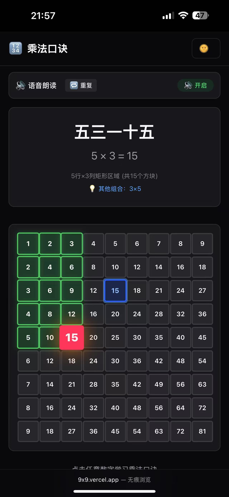

# 9x9 Multiplication Table Learning App

A modern, interactive web application designed to help students learn the 9x9 multiplication table with engaging visual and audio features.



## ✨ Features

### 🎯 Interactive Learning
- **Visual Grid**: Interactive 9x9 multiplication table with clickable cells
- **Formula Display**: Shows both Chinese traditional formulas and mathematical equations
- **Area Visualization**: Highlights rectangular areas to demonstrate multiplication concepts
- **Same Result Highlighting**: Automatically highlights all combinations that produce the same result

### 🔊 Audio Learning
- **Text-to-Speech**: Chinese pronunciation of multiplication formulas
- **Speech Controls**: Toggle audio on/off and repeat current formula
- **Optimized Speech**: Adjusted rate, pitch, and volume for better learning experience

### 🎨 User Experience
- **Responsive Design**: Works seamlessly on desktop and mobile devices
- **Dark/Light Theme**: Automatic theme switching support
- **Smooth Animations**: Engaging transitions and visual feedback
- **Touch-Friendly**: Optimized for touch devices with proper button sizing

### 🌏 Localization
- **Chinese Formulas**: Traditional Chinese multiplication mnemonics (口诀)
- **Bilingual Display**: Chinese formulas with Arabic numeral equations
- **Cultural Learning**: Authentic Chinese mathematical learning approach

## 🚀 Getting Started

### Prerequisites
- Node.js 18+ 
- npm or yarn

### Installation

1. **Clone the repository**
   ```bash
   git clone <repository-url>
   cd 9x9
   ```

2. **Install dependencies**
   ```bash
   npm install
   # or
   yarn install
   ```

3. **Run the development server**
   ```bash
   npm run dev
   # or
   yarn dev
   ```

4. **Open your browser**
   Navigate to [http://localhost:3000](http://localhost:3000)

### Docker Deployment

The app includes Docker support for easy deployment:

```bash
# Build and run with Docker Compose
docker-compose up -d

# Or build manually
docker build -t 9x9-app .
docker run -p 3000:3000 9x9-app
```

## 🎮 How to Use

1. **Select a Number**: Click any cell in the 9x9 grid
2. **Listen**: The app will automatically pronounce the Chinese formula
3. **Observe**: 
   - The selected cell is highlighted in blue
   - The rectangular area is shown in light blue
   - Cells with the same result are highlighted in a different shade
4. **Learn**: Read the Chinese formula and mathematical equation at the top
5. **Repeat**: Use the repeat button to hear the formula again
6. **Explore**: Try different combinations to see patterns and relationships

## 🛠️ Technology Stack

- **Framework**: Next.js 14 with TypeScript
- **Styling**: Tailwind CSS with custom themes
- **UI Components**: Custom responsive components
- **Audio**: Web Speech API for text-to-speech
- **Build**: Modern build tools with optimizations
- **Deployment**: Docker support included

## 📱 Browser Compatibility

- ✅ Chrome/Chromium browsers (full feature support)
- ✅ Safari (full feature support)
- ✅ Firefox (visual features, limited speech support)
- ✅ Edge (full feature support)
- 📱 Mobile browsers (touch-optimized)

## 🎓 Educational Benefits

### Visual Learning
- **Spatial Understanding**: Rectangle visualization helps understand multiplication as area
- **Pattern Recognition**: Highlighting same results reveals mathematical patterns
- **Interactive Engagement**: Hands-on learning maintains student attention

### Auditory Learning
- **Pronunciation Practice**: Hear correct Chinese pronunciation
- **Memory Aid**: Audio reinforcement helps memorization
- **Multi-sensory**: Combines visual and auditory learning styles

### Cultural Learning
- **Traditional Methods**: Authentic Chinese multiplication learning approach
- **Language Skills**: Chinese numeral system and pronunciation
- **Mathematical Heritage**: Traditional formula patterns and structure

## 🎯 Target Audience

- **Elementary Students**: Ages 6-12 learning basic multiplication
- **Chinese Language Learners**: Students learning mathematical Chinese
- **Teachers**: Educational tool for classroom or remote learning
- **Parents**: Home learning support tool

## 🔧 Development

### Project Structure
```
9x9/
├── app/                 # Next.js app directory
│   ├── page.tsx        # Main multiplication table component
│   ├── layout.tsx      # App layout and providers
│   ├── globals.css     # Global styles
│   └── ...
├── lib/                # Utility functions
├── public/             # Static assets
├── components.json     # UI component configuration
└── Docker files        # Deployment configuration
```

### Key Components
- **Multiplication Grid**: Interactive 9x9 table with state management
- **Speech System**: Text-to-speech integration with Chinese support
- **Theme Provider**: Dark/light mode support
- **Formula Converter**: Chinese numeral and formula generation

## 🤝 Contributing

Contributions are welcome! Please feel free to submit a Pull Request. For major changes, please open an issue first to discuss what you would like to change.

### Development Guidelines
- Follow TypeScript best practices
- Maintain responsive design principles
- Test on multiple browsers and devices
- Keep accessibility in mind
- Maintain Chinese language accuracy

## 📄 License

This project is open source and available under the [MIT License](LICENSE).

## 🙏 Acknowledgments

- Chinese educational methodology inspiration
- Modern web accessibility standards
- Mathematical learning research
- Open source community contributions

---

**Happy Learning! 学习愉快！** 🎉
